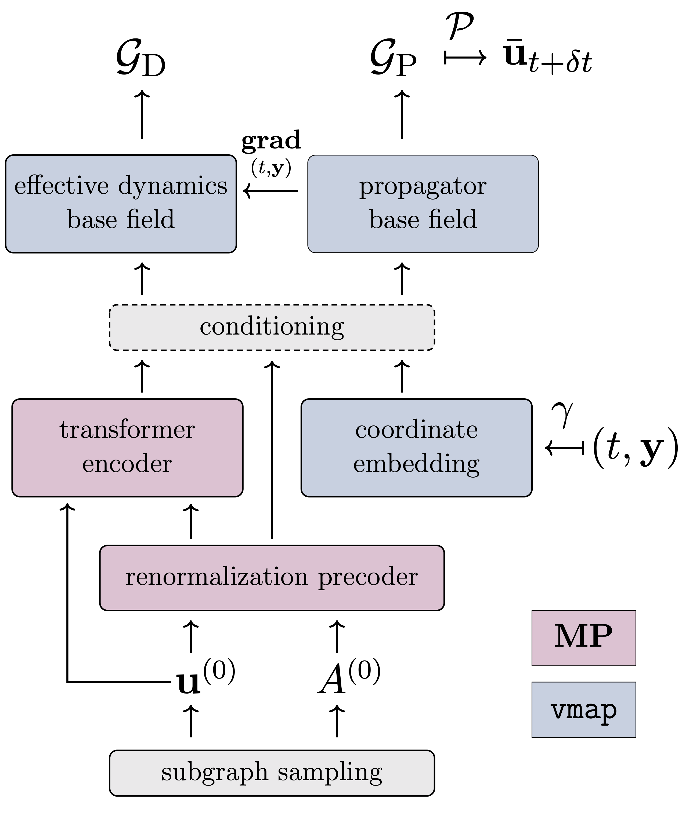

# Renormalized Operators with Multiscale Attention (ROMA)




This repository contains code and data accompanying the manuscript titled [Connecting the Geometry and Dynamics of Many-Body Complex Systems with Neural Operators](https://arxiv.org/abs/xxxx.yyyyy)

## Abstract

The relationship between scale transformations and dynamics via renormalization group theory is a cornerstone of modern physical theories, from fluid mechanics to elementary particle physics. Integrating renormalization group methods into neural operators for many-body complex systems could provide a foundational inductive bias for learning their effective dynamics, while also uncovering multiscale organization in an integrated fashion.
We introduce a scalable AI framework, ROMA (Renormalized Operators with Multiscale Attention), for learning multiscale evolution operators of many-body complex systems. In particular, we develop a renormalization procedure based on neural analagous of the geometric and laplacian renormalization groups, which can be co-learned with neural operators. An attention mechanism is used to model multiscale interactions that couple the renormalization and dynamics operators, as well as mirror the multiscale nature of complex systems.  We apply this framework in challenging conditions: large systems of more than 1M nodes, long-range interactions, and noisy input-output data for two contrasting examples: Kuramoto oscillators and burgers-like social dynamics. We show that the ROMA framework improves scalability and generalization compared to state-of-the-art operator learning techniques for large-scale systems, while simultaneously uncovering hierarchical and multiscale structure of complex systems in an explainable fashion.


## Installation

Dependencies can be installed with pip using the following commands:

```
pip3 install -U pip
pip3 install --upgrade jax jaxlib
pip3 install --upgrade -r requirements.txt
```

Then install the `roma` package by running the following command:

```
git clone https://github.com/nngabe/roma.git
cd roma
pip install -e .
```


## Datasets

### KM-38k 

Instructions for downloading the dataset can be found [here](./examples/README.md).

### KM-314k 

Instructions for downloading the dataset can be found [here](./examples/README.md).

### KM-3M 

Instructions for downloading the dataset can be found [here](./examples/README.md).

### BD-2M

Instructions for downloading the dataset can be found [here](./examples/README.md).

## Experiments

### Scaling & Noise

### Effective Dynamics

### Positional Embedding


## Citation
    @article{gabriel2024connecting,
      title={Connecting the Geometry and Dynamics of Many-Body Complex Systems with Neural Operators},
      author={Gabriel, Nicholas A and Johnson, Neil F and Karniadakis, George Em},
      journal={arXiv preprint arXiv:xxxx.yyyyy},
      year={2024}
    }
